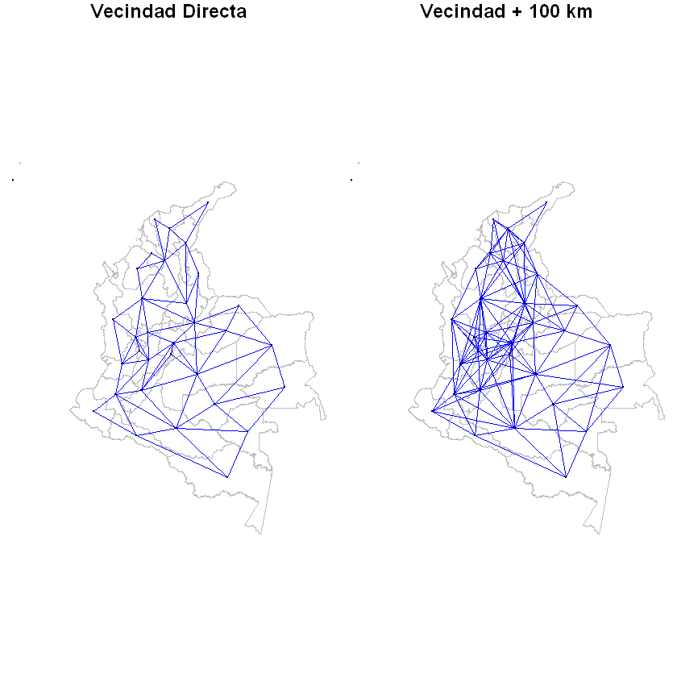
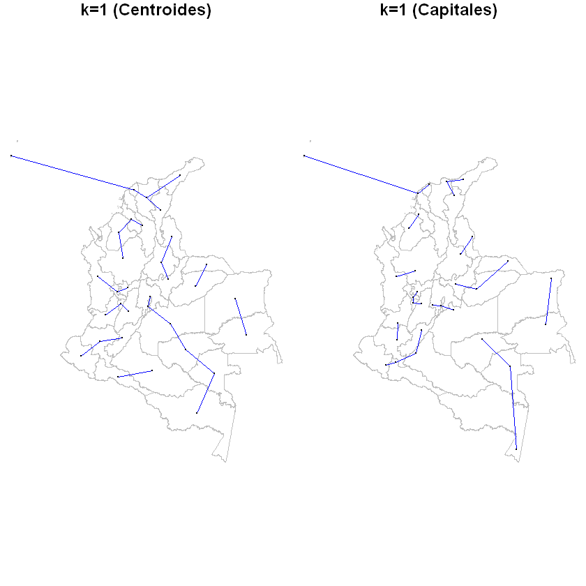
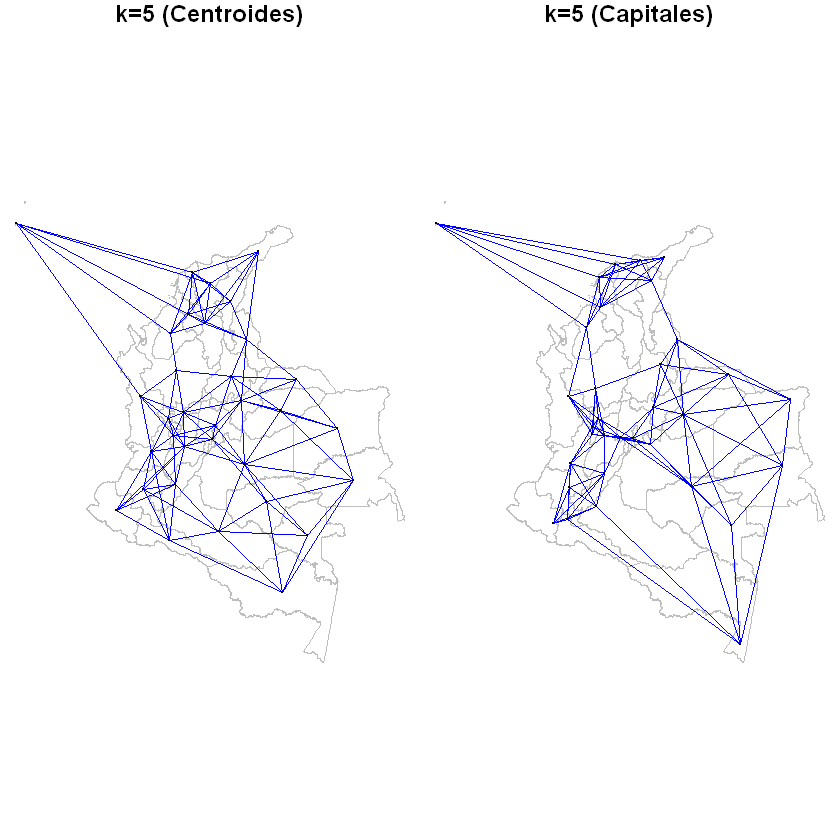
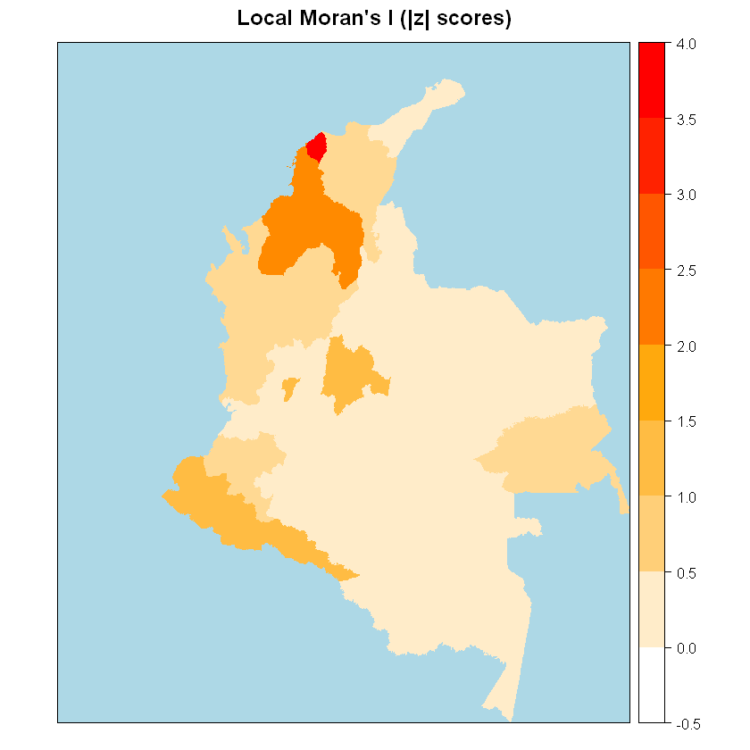
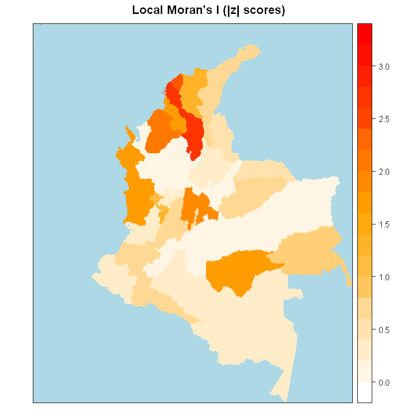

# Configurar Contigüidades

La contigüidad espacial se registra mediante una matriz de unos y ceros mediante la cual es posible evaluar si dos unidades terriroriales se encuentran cercana este sí. Una de las razones para revisar los aspectos relacionados con las contigüidades es la construcción de la matriz de pesos espaciales la cual, como se vio, está en función de la distancia que dos unidades registran entre sí.

Si se trata de patrones puntuales las contogüidades se registran normalmente, pero si se están evaluando datos de áreas (o a partir de polígonos) contruir de manera adecauda la matriz de contigüidades permite evaluar mejor las distancias y, por lo tanto, la matriz de pesos espaciales. Dependerá del tipo de ente territorial que se esté analizando. En el caso que se ha venido estudiando (Colombia) cuando se evalúan unidades territoriales como los departamentos no sucede lo mismo cuando el centroide señala el centro del mismo que cuando señala la capital del departamento.

En esta sesión se verá cómo es posible cambiar este aspecto para calcular la matriz de pesos espaciales.

El primer paso es cargar el mapa de departamentos que se tiene en la base de datos:


```R
library(rgdal) # Se cargan los mapas
```

    Loading required package: sp
    rgdal: version: 1.3-6, (SVN revision 773)
     Geospatial Data Abstraction Library extensions to R successfully loaded
     Loaded GDAL runtime: GDAL 2.2.3, released 2017/11/20
     Path to GDAL shared files: D:/Documentos/R/win-library/3.5/rgdal/gdal
     GDAL binary built with GEOS: TRUE 
     Loaded PROJ.4 runtime: Rel. 4.9.3, 15 August 2016, [PJ_VERSION: 493]
     Path to PROJ.4 shared files: D:/Documentos/R/win-library/3.5/rgdal/proj
     Linking to sp version: 1.3-1 
    


```R
departamentos <- readOGR(dsn = 'Mapas', layer = 'DepartamentosVeredas')
```

    OGR data source with driver: ESRI Shapefile 
    Source: "D:\Dropbox (Personal)\UIS\0000 SEMINARIO ESPACIAL\Bases\CENSO AGROPECUARIO\Total_nacional(csv)\Mapas", layer: "DepartamentosVeredas"
    with 33 features
    It has 1 fields
    

    Warning message in readOGR(dsn = "Mapas", layer = "DepartamentosVeredas"):
    "Z-dimension discarded"


```R
names(departamentos)
```


'DPTO_CCDGO'


```R
data <- departamentos
IDs <- departamentos$DPTO_CCDGO
names(data)
```


'DPTO_CCDGO'


Antes de continuar, es útil crear un par de funciones que permitan hacer cambios de escala facilmente:


```R
## Función: Convertir km a grados
km2d <- function(km){
out <- (km/1.852)/60
return(out)
}
```


```R
km2d(100) ## 100 km
```


0.899928005759539


```R
## Función: Convertir grados a km
d2km <- function(d){
out <- d*60*1.852
return(out)
}
```


```R
d2km(1) ## 1 grado
```


111.12


Un primer análisis de las contigüidades:


```R
library(spdep)
```

    Loading required package: Matrix
    Loading required package: spData
    To access larger datasets in this package, install the spDataLarge
    package with: `install.packages('spDataLarge',
    repos='https://nowosad.github.io/drat/', type='source')`
    


```R
## Vecindades sin establecer la distancia
W_cont <- poly2nb(data, queen=T)
W_cont_mat <- nb2listw(W_cont, style="W", zero.policy=TRUE)

## Vecindades estableciendo distancia (100 km)
W_cont_s <- poly2nb(data, queen=T, snap=km2d(100))
W_cont_s_mat <- nb2listw(W_cont_s, style="W", zero.policy=TRUE)
```


```R
map_crd <- coordinates(departamentos) # Se extraen las coordenadas
```

Y las gráficas quedan:


```R
par(mfrow=c(1,2),mar=c(0,0,1,0))

plot(data,border="grey")
plot(W_cont_mat,coords=map_crd,pch=19, cex=0.1, col="blue", add=T)
title("Vecindad Directa")

plot(data,border="grey")
plot(W_cont_s_mat,coords=map_crd,pch=19, cex=0.1, col="blue", add=T)
title("Vecindad + 100 km")
```





Como se observa, ampliar la distancia en 100 Km (0.9 grados) cambia las relaciones. Ahora, ¿cómo cambiarán estas relaciones si se considera la capital del departamento y no el centro del polígono?

Para respoderlo, es necesario incorporar esa información al mapa:


```R
library(readr)
capitales <- read_delim("capitales.txt", "\t", escape_double = FALSE, trim_ws = TRUE)
head(capitales)
```

    Parsed with column specification:
    cols(
      MPIO = col_double(),
      MPIO_CCDGO = col_double(),
      MUNICIPIO = col_character(),
      LONGITUD = col_double(),
      LATITUD = col_double(),
      DPTO_CCDGO = col_character()
    )
    


<table>
<thead><tr><th scope=col>MPIO</th><th scope=col>MPIO_CCDGO</th><th scope=col>MUNICIPIO</th><th scope=col>LONGITUD</th><th scope=col>LATITUD</th><th scope=col>DPTO_CCDGO</th></tr></thead>
<tbody>
	<tr><td>1110               </td><td> 5001              </td><td>MEDELLIN           </td><td>-75.61103          </td><td> 6.257590          </td><td>05                 </td></tr>
	<tr><td>  21               </td><td> 8001              </td><td>BARRANQUILLA       </td><td>-74.82772          </td><td>10.981520          </td><td>08                 </td></tr>
	<tr><td>1100               </td><td>11001              </td><td>BOGOTA             </td><td>-74.18107          </td><td> 4.316108          </td><td>11                 </td></tr>
	<tr><td> 986               </td><td>13001              </td><td>CARTAGENA DE INDIAS</td><td>-75.45890          </td><td>10.463430          </td><td>13                 </td></tr>
	<tr><td>1066               </td><td>15001              </td><td>TUNJA              </td><td>-73.37802          </td><td> 5.518473          </td><td>15                 </td></tr>
	<tr><td> 153               </td><td>17001              </td><td>MANIZALES          </td><td>-75.50726          </td><td> 5.083429          </td><td>17                 </td></tr>
</tbody>
</table>


Se transforma la variable de interés (DPTO_CCDGO) en factor:


```R
capitales<-as.data.frame(capitales)
capitales$DPTO_CCDGO<-factor(capitales$DPTO_CCDGO)
str(capitales)
```

    'data.frame':	33 obs. of  6 variables:
     $ MPIO      : num  1110 21 1100 986 1066 ...
     $ MPIO_CCDGO: num  5001 8001 11001 13001 15001 ...
     $ MUNICIPIO : chr  "MEDELLIN" "BARRANQUILLA" "BOGOTA" "CARTAGENA DE INDIAS" ...
     $ LONGITUD  : num  -75.6 -74.8 -74.2 -75.5 -73.4 ...
     $ LATITUD   : num  6.26 10.98 4.32 10.46 5.52 ...
     $ DPTO_CCDGO: Factor w/ 33 levels "05","08","11",..: 1 2 3 4 5 6 7 8 9 10 ...
     - attr(*, "spec")=
      .. cols(
      ..   MPIO = col_double(),
      ..   MPIO_CCDGO = col_double(),
      ..   MUNICIPIO = col_character(),
      ..   LONGITUD = col_double(),
      ..   LATITUD = col_double(),
      ..   DPTO_CCDGO = col_character()
      .. )
    

Ahora, se puede unir todo en un solo `data frame`:


```R
data <- as.data.frame(departamentos)
merged <- merge(data, capitales, by.x="DPTO_CCDGO", by.y="DPTO_CCDGO", all.x=T, all.y=F)
head(merged)
```


<table>
<thead><tr><th scope=col>DPTO_CCDGO</th><th scope=col>MPIO</th><th scope=col>MPIO_CCDGO</th><th scope=col>MUNICIPIO</th><th scope=col>LONGITUD</th><th scope=col>LATITUD</th></tr></thead>
<tbody>
	<tr><td>05                 </td><td>1110               </td><td> 5001              </td><td>MEDELLIN           </td><td>-75.61103          </td><td> 6.257590          </td></tr>
	<tr><td>08                 </td><td>  21               </td><td> 8001              </td><td>BARRANQUILLA       </td><td>-74.82772          </td><td>10.981520          </td></tr>
	<tr><td>11                 </td><td>1100               </td><td>11001              </td><td>BOGOTA             </td><td>-74.18107          </td><td> 4.316108          </td></tr>
	<tr><td>13                 </td><td> 986               </td><td>13001              </td><td>CARTAGENA DE INDIAS</td><td>-75.45890          </td><td>10.463430          </td></tr>
	<tr><td>15                 </td><td>1066               </td><td>15001              </td><td>TUNJA              </td><td>-73.37802          </td><td> 5.518473          </td></tr>
	<tr><td>17                 </td><td> 153               </td><td>17001              </td><td>MANIZALES          </td><td>-75.50726          </td><td> 5.083429          </td></tr>
</tbody>
</table>


Organizar un poco los fragmentos de datos:


```R
merged <- merged[order(merged$DPTO_CCDGO),]
map2<-departamentos
rownames(merged) <- map2$DPTO_CCDGO
rownames(map2@data) <- map2$DPTO_CCDGO
```

E in corporporar la data al mapa:


```R
library(dplyr)
```

    
    Attaching package: 'dplyr'
    
    The following objects are masked from 'package:stats':
    
        filter, lag
    
    The following objects are masked from 'package:base':
    
        intersect, setdiff, setequal, union
    
    


```R
map2@data <- left_join(map2@data, merged)
```

    Joining, by = "DPTO_CCDGO"
    


```R
head(map2@data)
```


<table>
<thead><tr><th scope=col>DPTO_CCDGO</th><th scope=col>MPIO</th><th scope=col>MPIO_CCDGO</th><th scope=col>MUNICIPIO</th><th scope=col>LONGITUD</th><th scope=col>LATITUD</th></tr></thead>
<tbody>
	<tr><td>05                 </td><td>1110               </td><td> 5001              </td><td>MEDELLIN           </td><td>-75.61103          </td><td> 6.257590          </td></tr>
	<tr><td>08                 </td><td>  21               </td><td> 8001              </td><td>BARRANQUILLA       </td><td>-74.82772          </td><td>10.981520          </td></tr>
	<tr><td>11                 </td><td>1100               </td><td>11001              </td><td>BOGOTA             </td><td>-74.18107          </td><td> 4.316108          </td></tr>
	<tr><td>13                 </td><td> 986               </td><td>13001              </td><td>CARTAGENA DE INDIAS</td><td>-75.45890          </td><td>10.463430          </td></tr>
	<tr><td>15                 </td><td>1066               </td><td>15001              </td><td>TUNJA              </td><td>-73.37802          </td><td> 5.518473          </td></tr>
	<tr><td>17                 </td><td> 153               </td><td>17001              </td><td>MANIZALES          </td><td>-75.50726          </td><td> 5.083429          </td></tr>
</tbody>
</table>


Extraer las coordenadas para la capitales


```R
map_crd2 <- cbind(map2$LONGITUD, map2$LATITUD) # Coordenadas de las Capitales
head(map_crd2)
```


<table>
<tbody>
	<tr><td>-75.61103</td><td> 6.257590</td></tr>
	<tr><td>-74.82772</td><td>10.981520</td></tr>
	<tr><td>-74.18107</td><td> 4.316108</td></tr>
	<tr><td>-75.45890</td><td>10.463430</td></tr>
	<tr><td>-73.37802</td><td> 5.518473</td></tr>
	<tr><td>-75.50726</td><td> 5.083429</td></tr>
</tbody>
</table>


Crear un ID para poder construir las matrices de pesos espaciales:


```R
data <- map2
IDs <- map2$DPTO_CCDGO
names(data)
```


<ol class=list-inline>
	<li>'DPTO_CCDGO'</li>
	<li>'MPIO'</li>
	<li>'MPIO_CCDGO'</li>
	<li>'MUNICIPIO'</li>
	<li>'LONGITUD'</li>
	<li>'LATITUD'</li>
</ol>


Ahora, se construyen las matrices (una para los centroides y una para las capitales). En este ejemplo, se calculan las matrices con una condicion adicional: sólo se tiene en cuenta el primer vecino (`k = 1`):


```R
library(spdep)
```


```R
#########
## k = 1
#########

## Centroides
W_knn1 <- knn2nb(knearneigh(map_crd, k=1), row.names=IDs)
W_knn1_mat <- nb2listw(W_knn1)

## Capitales
W_knn1_2 <- knn2nb(knearneigh(map_crd2, k=1), row.names=IDs)
W_knn1_mat_2 <- nb2listw(W_knn1_2)

```

Y el respectivo mapa:


```R
par(mfrow=c(1,2),mar=c(0,0,1,0))

plot(data,border="grey")
plot(W_knn1_mat,coords=map_crd,pch=19, cex=0.1, col="blue", add=T)
title("k=1 (Centroides)")

plot(data,border="grey")
plot(W_knn1_mat_2,coords=map_crd2,pch=19, cex=0.1, col="blue", add=T)
title("k=1 (Capitales)")
```





¿Que pasa si se cambia el número de vecinos a evaluar?


```R
#########
## k = 5
#########

## Centroides
W_knn1.5 <- knn2nb(knearneigh(map_crd, k=5), row.names=IDs)
W_knn1_mat.5 <- nb2listw(W_knn1.5)

## Capitales
W_knn1_2.5 <- knn2nb(knearneigh(map_crd2, k=5), row.names=IDs)
W_knn1_mat_2.5 <- nb2listw(W_knn1_2.5)
```


```R
par(mfrow=c(1,2),mar=c(0,0,1,0))

plot(data,border="grey")
plot(W_knn1_mat.5,coords=map_crd,pch=19, cex=0.1, col="blue", add=T)
title("k=5 (Centroides)")

plot(data,border="grey")
plot(W_knn1_mat_2.5,coords=map_crd2,pch=19, cex=0.1, col="blue", add=T)
title("k=5 (Capitales)")
```





¿Qué ocurre, entonces, con la autocorrelación espacial? Hay que recordar que la autocorrelación espacial se evalúa en función de la matriz de pesos y de las distancias. Como se observa en los mapas, las relaciones cambian.

En las sesiones anteriores se ha empleado el cultivo de la Yuca para ilustrar los ejemplos. Se evaluará la autocorrelación espacial con esta nueva configuración. En el ejercicio anterior se usaron los municipios como unidades territoriales; para apreciar si hay cambios o no se debe cambiar el análisis al nivel departamental.

Lo primero es cargar los datos:


```R
load('Total_nacional(csv)/Cultivos.RData')
```

Y seleccionar el cultivo:


```R
Cultivos$P_S6P46<-factor(Cultivos$P_S6P46) # Esto ya se discutió
cultivo1<-Cultivos[Cultivos$P_S6P46=='00159201001',]
```

Organizar algunas variables:


```R
cultivo1$P_DEPTO<-factor(cultivo1$P_DEPTO)
cultivo1$P_MUNIC<-factor(cultivo1$P_MUNIC)
cultivo1$COD_VEREDA<-factor(cultivo1$COD_VEREDA)
```

Se va a emplear el área cosechada para ilustar:


```R
areas<-aggregate(AREA_COSECHADA~P_DEPTO, FUN = sum, data = cultivo1)
```


```R
head(areas)
```


<table>
<thead><tr><th scope=col>P_DEPTO</th><th scope=col>AREA_COSECHADA</th></tr></thead>
<tbody>
	<tr><td>05       </td><td>16195.838</td></tr>
	<tr><td>08       </td><td> 1083.152</td></tr>
	<tr><td>13       </td><td>44495.876</td></tr>
	<tr><td>15       </td><td>14380.682</td></tr>
	<tr><td>17       </td><td>12544.785</td></tr>
	<tr><td>18       </td><td>14663.987</td></tr>
</tbody>
</table>


Se cambia el nombre de la variable con la que se van a unir las tablas


```R
areas$DPTO_CCDGO<-areas$P_DEPTO
areas$P_DEPTO<-NULL
head(areas)
```


<table>
<thead><tr><th scope=col>AREA_COSECHADA</th><th scope=col>DPTO_CCDGO</th></tr></thead>
<tbody>
	<tr><td>16195.838</td><td>05       </td></tr>
	<tr><td> 1083.152</td><td>08       </td></tr>
	<tr><td>44495.876</td><td>13       </td></tr>
	<tr><td>14380.682</td><td>15       </td></tr>
	<tr><td>12544.785</td><td>17       </td></tr>
	<tr><td>14663.987</td><td>18       </td></tr>
</tbody>
</table>


Se unen las tablas:


```R
data@data <- left_join(data@data, areas)
```

    Joining, by = "DPTO_CCDGO"
    Warning message:
    "Column `DPTO_CCDGO` joining factors with different levels, coercing to character vector"


```R
head(data@data)
```


<table>
<thead><tr><th scope=col>DPTO_CCDGO</th><th scope=col>MPIO</th><th scope=col>MPIO_CCDGO</th><th scope=col>MUNICIPIO</th><th scope=col>LONGITUD</th><th scope=col>LATITUD</th><th scope=col>AREA_COSECHADA</th></tr></thead>
<tbody>
	<tr><td>05                 </td><td>1110               </td><td> 5001              </td><td>MEDELLIN           </td><td>-75.61103          </td><td> 6.257590          </td><td>16195.838          </td></tr>
	<tr><td>08                 </td><td>  21               </td><td> 8001              </td><td>BARRANQUILLA       </td><td>-74.82772          </td><td>10.981520          </td><td> 1083.152          </td></tr>
	<tr><td>11                 </td><td>1100               </td><td>11001              </td><td>BOGOTA             </td><td>-74.18107          </td><td> 4.316108          </td><td>       NA          </td></tr>
	<tr><td>13                 </td><td> 986               </td><td>13001              </td><td>CARTAGENA DE INDIAS</td><td>-75.45890          </td><td>10.463430          </td><td>44495.876          </td></tr>
	<tr><td>15                 </td><td>1066               </td><td>15001              </td><td>TUNJA              </td><td>-73.37802          </td><td> 5.518473          </td><td>14380.682          </td></tr>
	<tr><td>17                 </td><td> 153               </td><td>17001              </td><td>MANIZALES          </td><td>-75.50726          </td><td> 5.083429          </td><td>12544.785          </td></tr>
</tbody>
</table>


Se cambian los datos perdidos por cero (sólo para efectos prácticos)


```R
data$AREA_COSECHADA[is.na(data$AREA_COSECHADA)] <- 0
```


```R
summary(data@data)
```


      DPTO_CCDGO             MPIO          MPIO_CCDGO     MUNICIPIO        
     Length:33          Min.   :  21.0   Min.   : 5001   Length:33         
     Class :character   1st Qu.: 745.0   1st Qu.:20001   Class :character  
     Mode  :character   Median : 991.0   Median :52001   Mode  :character  
                        Mean   : 852.7   Mean   :52153                     
                        3rd Qu.:1066.0   3rd Qu.:81001                     
                        Max.   :1110.0   Max.   :99001                     
        LONGITUD         LATITUD       AREA_COSECHADA 
     Min.   :-81.72   Min.   :-3.530   Min.   :    0  
     1st Qu.:-75.71   1st Qu.: 3.319   1st Qu.: 6239  
     Median :-74.83   Median : 5.083   Median :10181  
     Mean   :-74.22   Mean   : 5.555   Mean   :13452  
     3rd Qu.:-72.96   3rd Qu.: 8.112   3rd Qu.:17260  
     Max.   :-68.14   Max.   :12.543   Max.   :44496  


Ahora, se procede a evaluar la autocorrelación (usando la I de Morán) tomando en cuenta las distintas matrices de pesos espaciales que se construyero


```R
# Normal
moran.test(data$AREA_COSECHADA, listw=W_cont_mat, zero.policy=T)
```


    
    	Moran I test under randomisation
    
    data:  data$AREA_COSECHADA  
    weights: W_cont_mat  n reduced by no-neighbour observations
      
    
    Moran I statistic standard deviate = 0.84942, p-value = 0.1978
    alternative hypothesis: greater
    sample estimates:
    Moran I statistic       Expectation          Variance 
           0.06220558       -0.03225806        0.01236765 
    


```R
# 100 Km
moran.test(data$AREA_COSECHADA, listw=W_cont_s_mat, zero.policy=T)
```


    
    	Moran I test under randomisation
    
    data:  data$AREA_COSECHADA  
    weights: W_cont_s_mat  n reduced by no-neighbour observations
      
    
    Moran I statistic standard deviate = 0.84343, p-value = 0.1995
    alternative hypothesis: greater
    sample estimates:
    Moran I statistic       Expectation          Variance 
          0.035784845      -0.032258065       0.006508253 
    


```R
# Centroides
moran.test(data$AREA_COSECHADA, listw=W_knn1_mat, zero.policy=T)
```


    
    	Moran I test under randomisation
    
    data:  data$AREA_COSECHADA  
    weights: W_knn1_mat    
    
    Moran I statistic standard deviate = 1.0489, p-value = 0.1471
    alternative hypothesis: greater
    sample estimates:
    Moran I statistic       Expectation          Variance 
           0.19212952       -0.03125000        0.04535755 
    


```R
# Capitales
moran.test(data$AREA_COSECHADA, listw=W_knn1_mat_2, zero.policy=T)
```


    
    	Moran I test under randomisation
    
    data:  data$AREA_COSECHADA  
    weights: W_knn1_mat_2    
    
    Moran I statistic standard deviate = -0.59215, p-value = 0.7231
    alternative hypothesis: greater
    sample estimates:
    Moran I statistic       Expectation          Variance 
           -0.1624198        -0.0312500         0.0490682 
    


```R
# centroides k=5
moran.test(data$AREA_COSECHADA, listw=W_knn1_mat.5, zero.policy=T)
```


    
    	Moran I test under randomisation
    
    data:  data$AREA_COSECHADA  
    weights: W_knn1_mat.5    
    
    Moran I statistic standard deviate = 1.0076, p-value = 0.1568
    alternative hypothesis: greater
    sample estimates:
    Moran I statistic       Expectation          Variance 
          0.058484843      -0.031250000       0.007931913 
    


```R
# Capitales k=5
moran.test(data$AREA_COSECHADA, listw=W_knn1_mat_2.5, zero.policy=T)
```


    
    	Moran I test under randomisation
    
    data:  data$AREA_COSECHADA  
    weights: W_knn1_mat_2.5    
    
    Moran I statistic standard deviate = 1.3186, p-value = 0.09365
    alternative hypothesis: greater
    sample estimates:
    Moran I statistic       Expectation          Variance 
          0.086779727      -0.031250000       0.008012538 
    


La autocorrelación local se puede evaluar, ahora, a la luz de un par de matrices:


```R
lm1 <- localmoran(data$AREA_COSECHADA, listw=W_cont_mat, zero.policy=T)
data$lm1 <- abs(lm1[,4]) ## Extract z-scores
```


```R
lm.palette <- colorRampPalette(c("white","orange", "red"), space = "rgb")
```


```R
spplot(data, zcol="lm1", col.regions=lm.palette(20), main="Local Moran's I (|z| scores)", pretty=T, col="transparent",
      par.settings = list(panel.background=list(col="lightblue")))
```





```R
lm2 <- localmoran(data$AREA_COSECHADA, listw=W_knn1_mat_2.5, zero.policy=T)
data$lm2 <- abs(lm2[,4]) ## Extract z-scores
```


```R
spplot(data, zcol="lm2", col.regions=lm.palette(20), main="Local Moran's I (|z| scores)", pretty=T,col="transparent",
      par.settings = list(panel.background=list(col="lightblue")))
```





```R
data@data
```


<table>
<thead><tr><th scope=col>DPTO_CCDGO</th><th scope=col>MPIO</th><th scope=col>MPIO_CCDGO</th><th scope=col>MUNICIPIO</th><th scope=col>LONGITUD</th><th scope=col>LATITUD</th><th scope=col>AREA_COSECHADA</th><th scope=col>lm1</th><th scope=col>lm2</th></tr></thead>
<tbody>
	<tr><td>05                   </td><td>1110                 </td><td> 5001                </td><td>MEDELLIN             </td><td>-75.61103            </td><td> 6.257590            </td><td>16195.83837          </td><td>0.503372733          </td><td>0.04427836           </td></tr>
	<tr><td>08                   </td><td>  21                 </td><td> 8001                </td><td>BARRANQUILLA         </td><td>-74.82772            </td><td>10.981520            </td><td> 1083.15221          </td><td>3.712280076          </td><td>2.40682148           </td></tr>
	<tr><td>11                   </td><td>1100                 </td><td>11001                </td><td>BOGOTA               </td><td>-74.18107            </td><td> 4.316108            </td><td>    0.00000          </td><td>1.079767408          </td><td>0.78675210           </td></tr>
	<tr><td>13                   </td><td> 986                 </td><td>13001                </td><td>CARTAGENA DE INDIAS  </td><td>-75.45890            </td><td>10.463430            </td><td>44495.87649          </td><td>2.326270179          </td><td>2.83712870           </td></tr>
	<tr><td>15                   </td><td>1066                 </td><td>15001                </td><td>TUNJA                </td><td>-73.37802            </td><td> 5.518473            </td><td>14380.68195          </td><td>0.009676157          </td><td>0.05299484           </td></tr>
	<tr><td>17                   </td><td> 153                 </td><td>17001                </td><td>MANIZALES            </td><td>-75.50726            </td><td> 5.083429            </td><td>12544.78491          </td><td>0.158177310          </td><td>0.20466535           </td></tr>
	<tr><td>18                   </td><td> 179                 </td><td>18001                </td><td>FLORENCIA            </td><td>-75.55824            </td><td> 1.749139            </td><td>14663.98651          </td><td>0.045192763          </td><td>0.20051551           </td></tr>
	<tr><td>19                   </td><td> 436                 </td><td>19001                </td><td>POPAYAN              </td><td>-76.59194            </td><td> 2.471704            </td><td>29607.02923          </td><td>0.512821344          </td><td>0.74905559           </td></tr>
	<tr><td>20                   </td><td> 988                 </td><td>20001                </td><td>VALLEDUPAR           </td><td>-73.46326            </td><td>10.382036            </td><td> 9039.56282          </td><td>0.580503495          </td><td>0.66780768           </td></tr>
	<tr><td>23                   </td><td> 495                 </td><td>23001                </td><td>MONTERIA             </td><td>-75.95055            </td><td> 8.584698            </td><td>24211.03392          </td><td>2.368927573          </td><td>2.12289387           </td></tr>
	<tr><td>25                   </td><td> 523                 </td><td>25001                </td><td>AGUA DE DIOS         </td><td>-74.67111            </td><td> 4.372745            </td><td> 2851.22349          </td><td>1.154988956          </td><td>1.84073174           </td></tr>
	<tr><td>27                   </td><td> 935                 </td><td>27001                </td><td>QUIBDO               </td><td>-76.66368            </td><td> 5.938953            </td><td>30361.32792          </td><td>0.954680075          </td><td>1.63488305           </td></tr>
	<tr><td>41                   </td><td> 380                 </td><td>41001                </td><td>NEIVA                </td><td>-75.27236            </td><td> 2.993360            </td><td> 8198.29907          </td><td>0.267222264          </td><td>0.06114394           </td></tr>
	<tr><td>44                   </td><td>1102                 </td><td>44001                </td><td>RIOHACHA             </td><td>-72.95876            </td><td>11.242972            </td><td> 8661.29960          </td><td>0.380907125          </td><td>0.73896740           </td></tr>
	<tr><td>47                   </td><td>1101                 </td><td>47001                </td><td>SANTA MARTA          </td><td>-73.88528            </td><td>11.121894            </td><td>32606.15550          </td><td>0.869482144          </td><td>1.49850836           </td></tr>
	<tr><td>50                   </td><td>1096                 </td><td>50001                </td><td>VILLAVICENCIO        </td><td>-73.49290            </td><td> 4.091666            </td><td>14179.13937          </td><td>0.001547429          </td><td>0.02072196           </td></tr>
	<tr><td>52                   </td><td>1035                 </td><td>52001                </td><td>PASTO                </td><td>-77.20610            </td><td> 1.083605            </td><td>36607.87119          </td><td>1.464441103          </td><td>0.38885263           </td></tr>
	<tr><td>54                   </td><td> 991                 </td><td>54001                </td><td>CUCUTA               </td><td>-72.48863            </td><td> 8.112098            </td><td> 9582.26717          </td><td>0.211739659          </td><td>0.41440174           </td></tr>
	<tr><td>63                   </td><td> 745                 </td><td>63001                </td><td>ARMENIA              </td><td>-75.72490            </td><td> 4.499504            </td><td> 1631.72042          </td><td>1.122941878          </td><td>1.47614010           </td></tr>
	<tr><td>66                   </td><td> 574                 </td><td>66001                </td><td>PEREIRA              </td><td>-75.71236            </td><td> 4.781292            </td><td> 1502.51927          </td><td>0.044820730          </td><td>1.22276949           </td></tr>
	<tr><td>68                   </td><td> 958                 </td><td>68001                </td><td>BUCARAMANGA          </td><td>-73.11157            </td><td> 7.155836            </td><td> 9026.31188          </td><td>0.392608805          </td><td>0.32567312           </td></tr>
	<tr><td>70                   </td><td>1109                 </td><td>70001                </td><td>SINCELEJO            </td><td>-75.43175            </td><td> 9.316674            </td><td>22449.87174          </td><td>2.323640192          </td><td>1.67417727           </td></tr>
	<tr><td>81                   </td><td> 955                 </td><td>81001                </td><td>ARAUCA               </td><td>-70.50921            </td><td> 6.796281            </td><td> 6902.68753          </td><td>0.212522504          </td><td>0.41933695           </td></tr>
	<tr><td>85                   </td><td>1064                 </td><td>85001                </td><td>YOPAL                </td><td>-72.25803            </td><td> 5.242745            </td><td> 6238.92233          </td><td>0.480490084          </td><td>0.73738437           </td></tr>
	<tr><td>86                   </td><td>1039                 </td><td>86001                </td><td>MOCOA                </td><td>-76.68436            </td><td> 1.228575            </td><td> 7411.60239          </td><td>1.114968662          </td><td>0.71241032           </td></tr>
	<tr><td>88                   </td><td>1005                 </td><td>88001                </td><td>SAN ANDRES           </td><td>-81.71762            </td><td>12.543117            </td><td>   88.75956          </td><td>        NaN          </td><td>3.01421072           </td></tr>
	<tr><td>91                   </td><td>1007                 </td><td>91001                </td><td>LETICIA              </td><td>-70.04513            </td><td>-3.530142            </td><td>17259.81546          </td><td>0.240456472          </td><td>0.21304551           </td></tr>
	<tr><td>94                   </td><td>1054                 </td><td>94001                </td><td>INIRIDA              </td><td>-68.45724            </td><td> 3.319405            </td><td>20341.50395          </td><td>0.615043984          </td><td>0.84214651           </td></tr>
	<tr><td>95                   </td><td>1081                 </td><td>95001                </td><td>SAN JOSE DEL GUAVIARE</td><td>-71.91917            </td><td> 2.484286            </td><td> 3190.93267          </td><td>0.092754181          </td><td>1.78114891           </td></tr>
	<tr><td>97                   </td><td>1047                 </td><td>97001                </td><td>MITU                 </td><td>-70.41755            </td><td> 1.015572            </td><td> 2665.65668          </td><td>0.010370971          </td><td>0.33966620           </td></tr>
	<tr><td>99                   </td><td> 934                 </td><td>99001                </td><td>PUERTO CARRENO       </td><td>-68.14122            </td><td> 5.836530            </td><td>15039.50987          </td><td>0.027219171          </td><td>0.05652976           </td></tr>
	<tr><td>76                   </td><td> 771                 </td><td>76001                </td><td>CALI                 </td><td>-76.57649            </td><td> 3.399044            </td><td>10729.02856          </td><td>0.011521202          </td><td>0.25401276           </td></tr>
	<tr><td>73                   </td><td>1098                 </td><td>73001                </td><td>IBAGUE               </td><td>-75.25259            </td><td> 4.451922            </td><td>10181.25309          </td><td>0.406534370          </td><td>0.71783903           </td></tr>
</tbody>
</table>


